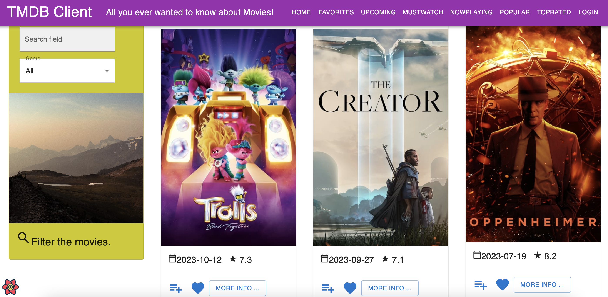
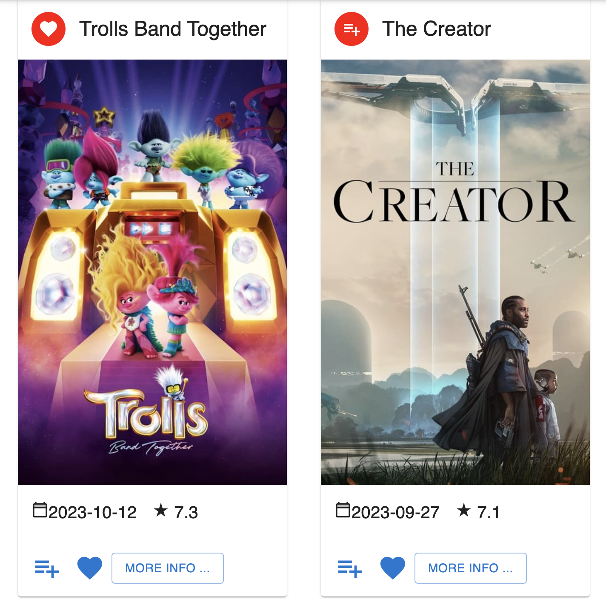
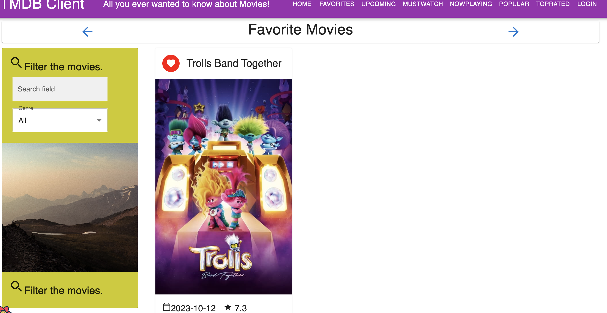
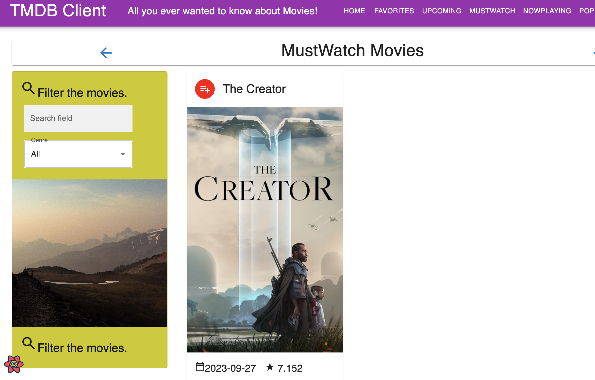
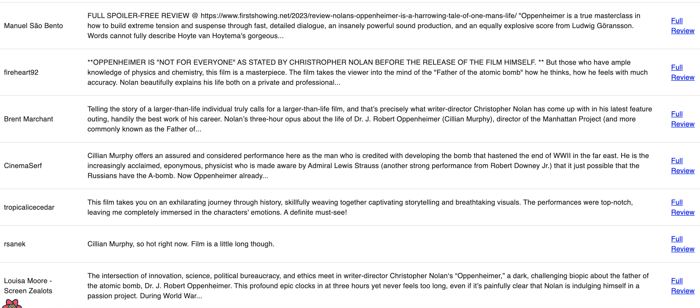
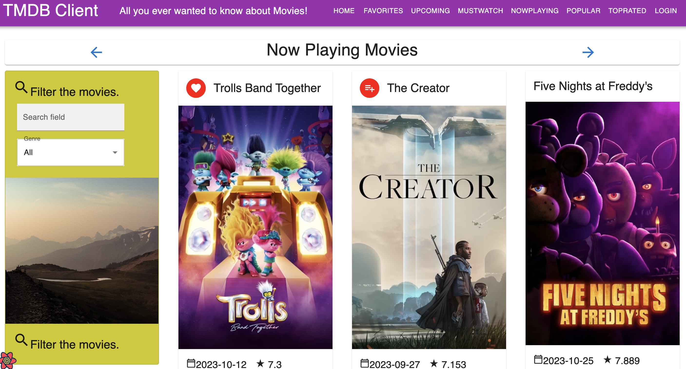
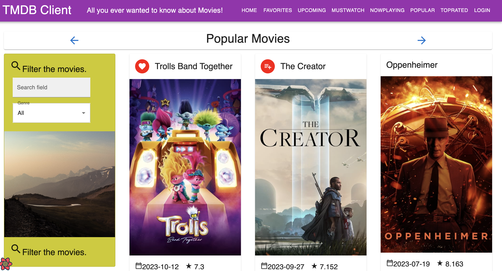
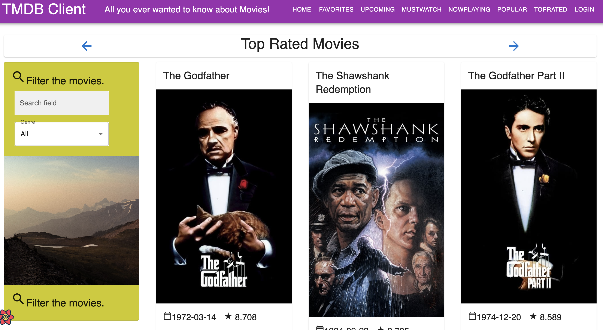
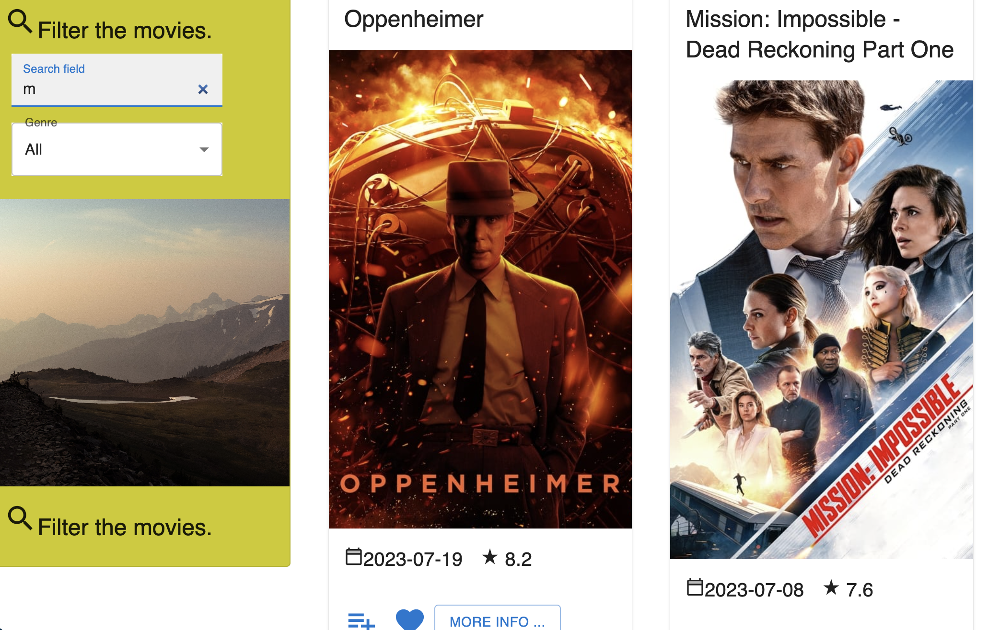
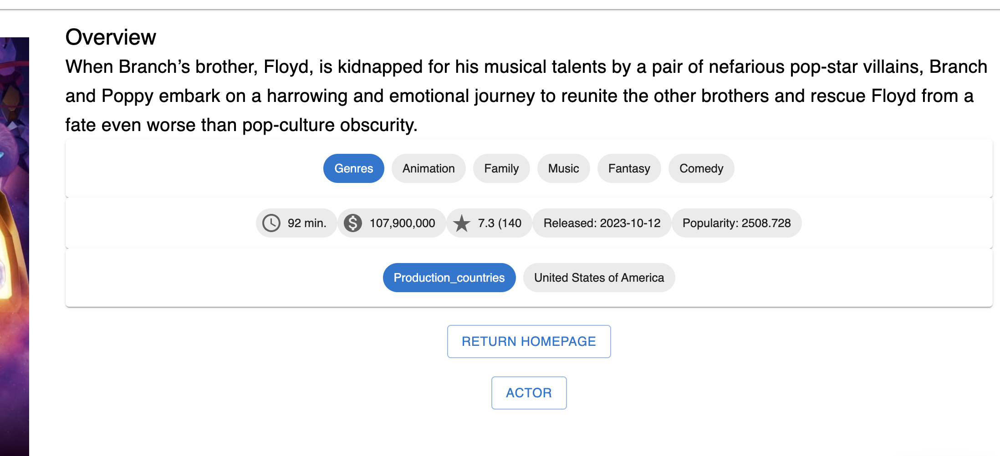

# movie-assignment-one
# Assignment 1 - ReactJS app.

Name: Yangqing Li

## Overview.

Web movies app Assignment 1

### Features. 
+ Upcoming Movies Page
+ top Rated Page
+ popularMovies page
+ now Playing Page
+ actor pages
+ actor filter
+ can return homepage from movie details page
+ can return actor page from movie details page
+ login page 
+ must watch button to add to must watch page

## API endpoints.
- https://api.themoviedb.org/3/movie/${id}/credits  -get actors info in the movie details screen
- https://api.themoviedb.org/3/person/popular - get a list of popular actors.
- https://api.themoviedb.org/3/person/${id}/images -get images for actors
- https://api.themoviedb.org/3/movie/upcoming -get upcoming movies
- https://api.themoviedb.org/3/movie/now_playing -get now_playing movies
- https://api.themoviedb.org/3/movie/top_rated -get top_rated movies
- https://api.themoviedb.org/3/movie/popular -get popular movies
- https://api.themoviedb.org/3/authentication/token/new -Create a temporary request token that can be used to validate a TMDB user login
- https://api.themoviedb.org/3/authentication/token/validate_with_login -Validate a request token by entering a username and password.
- https://api.themoviedb.org/3/authentication/session/new -Create a fully valid session ID once a user has validated the request token

### Component catalogue.

> Shows what I can display on my current home page, basically in the header_site. The interface can be jumped through buttons.

> The login page is shown in the figure above.

> when click the add to favourite or add to must watch button it will turn red.

> Show movies which had been add to favourite.

> Show movies which had been add to mustwatch.

> Review is still displayed as a drop-down menu

> Shows what I can display on my current hnowplaying page

> A list of upcoming movies.

> A list of popular movies.

> A list of top rated movies.

> Search movies by name this example is search which name contains 'm'.

>Search movies by genre this example is search which name contains 'm' and which genre is action.

>Two buttons in moviedetails page one can turn to home page another one can turn to actor page.

>It is a list of actor.

>It is a filter witch can search actor by name.

